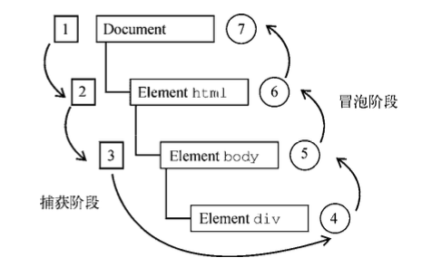

# Event Bubbling & Capture

> [原题](https://h5bp.org/Front-end-Developer-Interview-Questions/translations/chinese/#js-questions)

## Event Bubbling

事件冒泡，最早为 IE 定义，事件从最具体的元素开始触发，然后向上传播至文档，自底向上。

## Event Capture

事件捕获，最早为 Netscape 定义，事件从最不具体的节点出发，到最具体的节点最后收到事件，自顶向下。

## DOM 事件流

DOM2 Evnets 规范规定事件分为 3 个阶段：

1. 事件捕获
2. 到达目标
3. 事件冒泡

需要注意的是，规范中明确捕获阶段不会命中事件目标，但浏览器实现里都会在捕获阶段时在事件目标上触发事件。换句话说，就是在目标元素上可以同时处理事件的捕获和冒泡。

